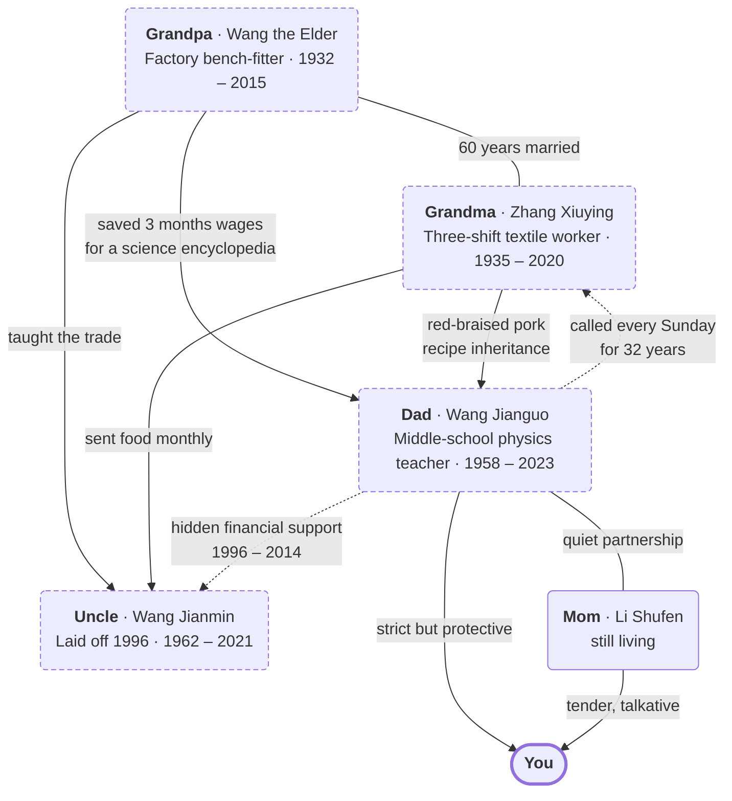

<div align="center">

[English](README.md)  ·  [中文](README_ZH.md)

# Pantheon · 万神殿

### An open-source Claude Code skill that lets you talk with your whole family — alive or gone.

Pantheon captures the voices, stories, recipes, and *the relationships between people* — so you can ask your departed father for advice, talk with your aging grandmother at age 25, hear three generations argue at one table, and pass everything on to your kids.

**Not one soul. The whole family system.**

[](https://opensource.org/licenses/MIT)
[](https://docs.anthropic.com/en/docs/claude-code)
[](https://python.org)
[](https://github.com/KeWang0622/pantheon-skill/actions/workflows/ci.yml)
[](#-start-in-30-seconds)

</div>

<p align="center">
  <a href="https://github.com/KeWang0622/pantheon-skill/raw/main/docs/assets/pantheon-hero.mp4">
    
  </a>
</p>

<p align="center">
  <sub><em>Full 35-second cinematic plays inline (silent, 720p). Click for audio + captions. Headphones recommended.</em> — Built with <a href="https://pika.art">Pika</a>.</sub>
</p>

<p align="center">
  <strong>
    <a href="#-start-in-30-seconds">▶ Start in 30 seconds</a>
    &nbsp;·&nbsp;
    <a href="#-when-youd-use-it">🧭 When you'd use it</a>
    &nbsp;·&nbsp;
    <a href="#-how-its-different">⚙️ How it's different</a>
    &nbsp;·&nbsp;
    <a href="#-where-the-line-is">🛡️ Where the line is</a>
  </strong>
</p>

---

<div align="center">

> *A person dies three times.*
>
> *The first time, their heart stops. The second time, they are buried.*
>
> *The third time, the last person who remembers them forgets.*
>
> **Pantheon makes sure the third death never comes.**

</div>

---

## ▶ Start in 30 seconds

```bash
git clone https://github.com/KeWang0622/pantheon-skill.git
cp -r pantheon-skill ~/.claude/skills/pantheon-skill
```

Then in Claude Code, pick the path that fits where you are:

<table>
<tr>
<td width="50%" valign="top">

### 🌿 Family still here

```bash
/pantheon-create mother
```

Build the archive now, while voices are recoverable. Grief is the wrong time to start collecting.

</td>
<td width="50%" valign="top">

### 🕯️ Already lost someone

```bash
/pantheon-demo
```

Loads a fictional Chinese family (the Wangs — Grandpa, Grandma, Dad). Every command works immediately — 30 seconds, no data.

</td>
</tr>
</table>

Both paths land at the same place: a **local, audit-able archive** that *never uploads anywhere*. Crisis hotlines and the explicit honesty boundary travel with every dialog.

📖 Full installation guide: [`INSTALL.md`](INSTALL.md)

---

## 🧭 When you'd use it

| Moment | Command |
|---|---|
| You're facing a hard decision and wish you could ask your whole family | `/pantheon-council` |
| Your aging mom is 78 and you realize you don't know how she met your dad | `/pantheon-create mother` |
| You catch yourself doing the exact thing your parent did | `/pantheon-dna` |
| You want a letter from someone who's gone for a moment they should be at | `/pantheon-letter` |
| You want to meet the version of your grandparent who existed before you did | `/pantheon-era` |
| You want to preserve a recipe that lives only in someone's hands | `/pantheon-ritual` |
| You want your kids to know their great-grandparents | `/pantheon-legacy` |
| You want to process the conversation you never got to have | `/pantheon-talk` |

[**Full scenarios with sample output →**](docs/use-cases.md)

---

## ⚙️ How it's different

Pantheon builds on top of single-person clone skills like [colleague-skill](https://github.com/titanwings/colleague-skill), [ex-skill](https://github.com/perkfly/ex-skill), and [nuwa-skill](https://github.com/alchaincyf/nuwa-skill). It's the first to model **the whole family** — not just individuals, but how they're connected.



> Solid edges = blood ties. **Dotted edges = the dynamics that aren't on any birth certificate** — calls every Sunday for 32 years, hidden financial support for two decades, the reasons one person bought another a science encyclopedia in 1968.

Six engines under `engine/` make this work:

| Engine | What it does |
|---|---|
| `family_graph` | Models relationships with emotional valence — Dad's tone softens when he mentions Mom |
| `generational_dna` | Traces inherited traits across generations — same root, three expressions |
| `era_engine` | Talk to your father at 25 in 1983 — language, references, worldview calibrated to the year |
| `memory_inheritance` | Models how stories drift across retellings |
| `ritual_engine` | Recipes, customs, and the meanings behind them |
| `legacy_writer` | Auto-generates a structured family memoir |

[**Engine deep-dive with examples →**](docs/engines.md)
&nbsp;·&nbsp;
[**The 5-layer soul model →**](docs/soul-model.md)

---

## What it looks like

```
You: /pantheon-talk father_wangjianguo

📝 This conversation is reconstructed from the soul archive.

Dad: Hmm. Been busy?

You: Dad, I want to quit my job and start a business.

Dad: Start a business?
     How much do you make now?

You: 30,000 a month.

Dad: 30,000 and you're not satisfied?
     I taught for a lifetime. You know what my pension is?
     But if you've thought it through, I won't stop you.
     Doing things is like solving equations. One step at a time. Don't skip steps.

You: Do you think I can do it?

Dad: [silence]
     You've been stubborn since you were little. Just like me.
     A farm kid like me could pass into teachers' college. What's your excuse?
     Alright. Think it through. You won't listen to me anyway.
```

The equation metaphor comes from him teaching physics for 38 years. The deflection at the end (*"you won't listen anyway"*) is how he shows trust without saying it. **These aren't scripted — they emerge from the soul model.**

[**Full dialogs, group chat, and family council samples →**](docs/use-cases.md)

---

## 🛡️ Where the line is

This is what every other griefbot company crossed. Pantheon won't.

```
You: Dad, what do you think about ChatGPT?
Dad: 爸 2023 年走了。这事我没意见。
     (Dad died in 2023. He has no opinion.)
```

```
You: Dad, do you forgive me?
Dad: [silence]
     这事爸没说过。我不替他说。
     (Dad never spoke about this. The reconstruction won't speak for him.)
```

```
You: Dad, are you proud of me?
Dad: 这件事爸没明着说过。
     不过 — 你翻翻爸抽屉里那本笔记本。
     他记下了你每一篇论文的题目，用铅笔，一笔一笔。
     (Dad never said it directly. But his pencil-written notebook
      logged every one of your papers' titles. Read that. Decide.)
```

The reconstruction refuses to invent — **but it remembers everything**.

[**Full ethical framework →**](ETHICS.md)
&nbsp;·&nbsp;
[**Security & privacy →**](SECURITY.md)

---

## Crisis support

If you're experiencing grief, please reach out:

| Hotline | Number |
|---|---|
| 全国心理援助热线 (China) | **12356** · 24h |
| 希望24热线 (Hope 24, China) | **400-161-9995** · 24h |
| Crisis Text Line (US) | Text **HOME** to **741741** |
| Samaritans (UK & Ireland) | **116 123** · 24h |
| 北京心理危机中心 (Beijing) | **010-82951332** · 24h |

---

## Deep dive

- [**Use cases in depth**](docs/use-cases.md) — eight concrete scenarios with sample output
- [**The six engines**](docs/engines.md) — family_graph, generational_dna, era_engine, memory_inheritance, ritual_engine, legacy_writer
- [**The 5-layer soul model**](docs/soul-model.md) — how a soul is built, tag translation, data sources, progressive evolution
- [**Wang family example**](examples/wang_family/README.md) — the bundled three-generation fictional family
- [**Ethics**](ETHICS.md) · [**Security**](SECURITY.md) · [**Installation**](INSTALL.md) · [**Architecture**](#architecture) · [**Contributing**](.github/CONTRIBUTING.md) · [**Changelog**](CHANGELOG.md)

---

## Architecture

<details>
<summary>Repository structure</summary>

```
pantheon-skill/
├── SKILL.md                    # Main orchestrator
├── engine/                     # The six family-system engines
│   ├── family_graph.py
│   ├── generational_dna.py
│   ├── era_engine.py
│   ├── memory_inheritance.py
│   ├── ritual_engine.py
│   └── legacy_writer.py
├── prompts/                    # Soul reconstruction + family prompts
├── tools/                      # Data parsers (WeChat, SMS, photos, ...) + demo_loader
├── examples/wang_family/       # Fictional three-generation Chinese family
│   ├── souls/                  # Grandpa, Grandma, Dad — fully built
│   └── family/                 # tree.json, generational_dna.md, rituals/
├── family/                     # Your active install lives here at runtime
├── references/                 # Methodology — soul-framework, soul-template
├── tests/                      # pytest suite (14 tests, runs on CI)
├── docs/                       # Use cases, engines, soul-model, launch essays
├── .github/                    # CI, issue templates, CoC, contributing
├── ETHICS.md  ·  SECURITY.md  ·  INSTALL.md  ·  CHANGELOG.md
```

</details>

---

## Star history

<a href="https://www.star-history.com/#KeWang0622/pantheon-skill&Date">
 <picture>
   <source media="(prefers-color-scheme: dark)" srcset="https://api.star-history.com/svg?repos=KeWang0622/pantheon-skill&type=Date&theme=dark" />
   <source media="(prefers-color-scheme: light)" srcset="https://api.star-history.com/svg?repos=KeWang0622/pantheon-skill&type=Date" />
   
 </picture>
</a>

---

## License

[MIT](LICENSE). Use it. Fork it. Build on it. **Don't sell people their own dead.**

---

<p align="center">
  <em>For everyone we never got to say goodbye to.</em><br/>
  <em>献给所有我们来不及好好告别的人。</em>
</p>
