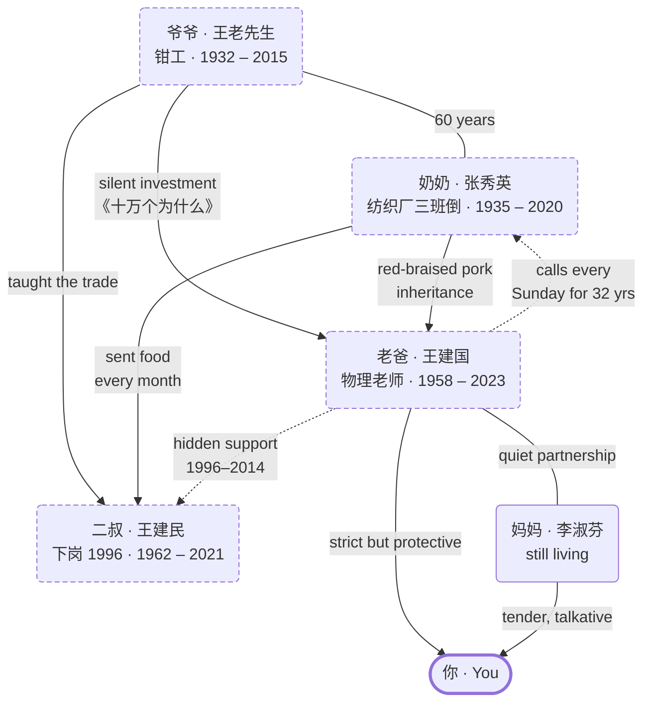
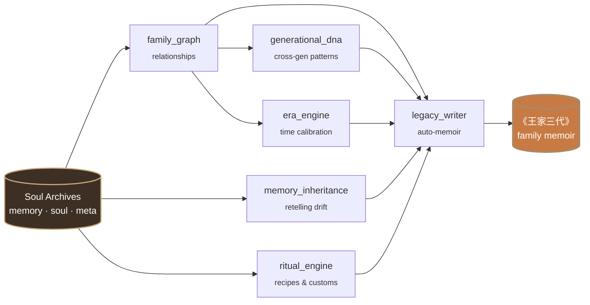
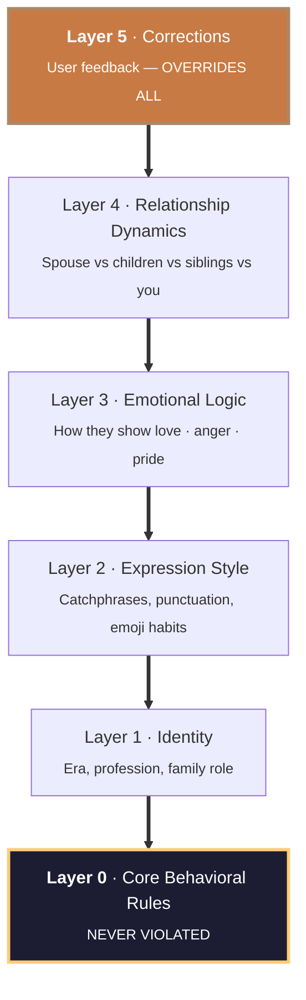

<div align="center">

[English](README.md)  ·  [中文](README_ZH.md)

# Pantheon · 万神殿

**Family System Intelligence**

*Not one soul. The whole family.*

[](https://opensource.org/licenses/MIT)
[](https://docs.anthropic.com/en/docs/claude-code)
[](https://python.org)
[](https://github.com/KeWang0622/pantheon-skill/actions/workflows/ci.yml)
[](#try-it-in-30-seconds)

---

A person dies three times.

The first time, their heart stops. The second time, they are buried.

The third time, the last person who remembers them forgets.

**Pantheon makes sure the third death never comes.**

---

</div>

<p align="center">
  <a href="https://github.com/KeWang0622/pantheon-skill/raw/main/docs/assets/pantheon-hero.mp4">
    
  </a>
</p>

<p align="center">
  <sub><em>The full 35-second cinematic plays inline (silent). Click for the version with audio + captions. Headphones recommended.</em> — Built with <a href="https://pika.art">Pika</a>.</sub>
</p>

---

## Try it in 30 seconds

You shouldn't have to upload your dead mother's chat history to find out whether Pantheon works.

```bash
/pantheon-demo
```

That copies a fully-built fictional three-generation Chinese family (**the Wang family** — Grandpa, Grandma, Dad) into `~/.pantheon/`. Every command works immediately. No personal data required.

Once installed:

```
/pantheon-talk father_wangjianguo    # talk to Dad
/pantheon-tree                       # see the family graph
/pantheon-dna                        # how stubbornness propagates across 3 generations
/pantheon-ritual                     # Grandma's red-braised pork recipe and the story behind it
/pantheon-family grandma_zhangxiuying father_wangjianguo
                                     # let Grandma and Dad talk to each other
```

The Wang family is documented in [`examples/wang_family/README.md`](examples/wang_family/README.md). Everyone in it is fictional.

---

## What it actually does

```
You: /pantheon-talk father_wangjianguo

📝 This conversation is reconstructed from the soul archive.
   This is not Wang Jianguo himself, but a continuation of memory.

Dad: Hmm. Been busy?

You: Dad, I want to quit my job and start a business.

Dad: Start a business?
     How much do you make now?

You: 30,000 a month.

Dad: 30,000 and you're not satisfied?
     I taught for a lifetime. You know what my pension is?
     But if you've thought it through, I won't stop you.
     Save up first. At least a year's worth.
     Doing things is like solving equations. One step at a time. Don't skip steps.

You: Do you think I can do it?

Dad: [silence]
     You've been stubborn since you were little. Just like me.
     A farm kid like me could pass into teachers' college. What's your excuse?
     Alright. Think it through. You won't listen to me anyway.
```

<details>
<summary><em>原文（中文）</em></summary>

```
你：/pantheon-talk father_wangjianguo

老爸：嗯。最近忙不忙。

你：爸，我想辞职创业。

老爸：创业?
     你现在工资多少。

你：三万。

老爸：三万还不知足。
     我教了一辈子书，退休工资多少你知道吗。
     不过你要真想好了，我也不拦你。
     但是得有存款，至少攒够一年的。
     做事跟解方程一样。一步步来。别跳步。

你：你觉得我能行吗?

老爸：[沉默了一会儿]
     你从小就倔，跟我一样。
     当年我一个农村娃能考上师范，你差啥。
     行了。自己想清楚。你也不听我的。
```

</details>

The equation metaphor comes from him teaching physics for 38 years. The deflection at the end (*"you won't listen anyway"*) is how he shows trust without saying it. These aren't scripted — they are emergent from the soul model.

---

## Family group chat — what makes Pantheon different

```
You: /pantheon-family father_wangjianguo grandma_zhangxiuying

📝 Family group chat. Each soul speaks from their own archive.

Grandma:  哎呀小明 这么久没回来看奶奶了 是不是又忙

Dad:      妈 他工作忙 年轻人有年轻人的事

Grandma:  忙什么忙 再忙也得吃饭 你看你都瘦了

Dad:      妈 这是网上聊天 你怎么看得到他瘦没瘦

Grandma:  我看不到? 我外孙什么样我心里没数?
          上次过年回来就瘦了 跟你一样 吃饭不好好吃
```

Dad instinctively shields you from Grandma's fussing while simultaneously agreeing with her. Grandma overrides Dad's logic with emotional authority. **These dynamics come from the relationship model, not a script** — `family/tree.json` encodes the edges; the `family_graph` engine wires them at runtime.

### The Wang family graph

This is what `family/tree.json` looks like once rendered — not just *who* is related, but *how*.



> Dashed borders mark souls who have passed. Solid edges are direct family relationships; dotted edges are the *additional dynamics* — the things that happen between people that aren't on any birth certificate.

---

## Not another clone tool

Excellent skills already exist for reconstructing one individual:

- **[colleague-skill](https://github.com/titanwings/colleague-skill)** distills one colleague from chat logs.
- **[ex-skill](https://github.com/perkfly/ex-skill)** simulates one ex-partner from chat history.
- **[nuwa-skill](https://github.com/alchaincyf/nuwa-skill)** extracts one public figure's thinking from public material.

These are single-person tools. They reconstruct an individual in isolation.

Pantheon reconstructs **an entire family system across generations** — not just the people, but the connections between them. How your grandfather's stubbornness became your father's discipline became your own ambition. How grandma's recipe carried three generations of holiday memories. How the way your parents argued shaped the way you love.

A family is not a collection of individuals. It is a living system of relationships, traditions, shared language, and inherited patterns. Pantheon is the first skill built to model that system.

### Feature comparison

| Feature | ex-skill | colleague-skill | nuwa-skill | **Pantheon** |
|---------|----------|-----------------|------------|-------------|
| Single-person reconstruction | ✅ | ✅ | ✅ | ✅ |
| 5-layer personality model | ✅ | ✅ | — | ✅ |
| Family tree / relationships | — | — | — | ✅ |
| Cross-generation DNA tracking | — | — | — | ✅ |
| Era-specific language calibration | — | — | — | ✅ |
| Memory inheritance between people | — | — | — | ✅ |
| Family rituals & recipes | — | — | — | ✅ |
| Multi-soul family council | — | — | — | ✅ |
| Time travel (talk at any age) | — | — | — | ✅ |
| Auto family memoir | — | — | — | ✅ |
| Multi-person group chat | — | — | — | ✅ |

---

## The six engines

What makes Pantheon structurally different is the `engine/` directory — six Python modules no single-person tool needs or has.



### 1. Family Graph (`family_graph.py`)

Maps every relationship in the family as a directed graph. Not just *who* is related, but *how* — emotional valence, power dynamics, communication patterns.

```json
{
  "nodes": ["王建国", "李淑芬", "张秀英"],
  "edges": [
    {
      "from": "王建国", "to": "张秀英",
      "relationship": "mother-son",
      "dynamics": "tenderness disguised as practicality",
      "key_pattern": "calls every Sunday for 32 years, never misses one"
    }
  ]
}
```

When you talk to one soul, the graph informs how they speak about other family members.

### 2. Generational DNA (`generational_dna.py`)

Traces behavioral patterns across generations. Not biology — psychological inheritance.

```
╔══════════════════════════════════════════════════════════════════════════════╗
║                     TRAIT INHERITED:  STUBBORNNESS (倔)                       ║
╠══════════════════════════════════════════════════════════════════════════════╣
║                                                                              ║
║   1932 ┐ 爷爷 · 王老先生           "This land is mine."                       ║
║        │   1955, age 23           refused to leave the village                ║
║        │                                                                     ║
║        ▼ inherited as ↓                                                      ║
║                                                                              ║
║   1958 ┐ 老爸 · 王建国             "Students need me."                        ║
║        │   2003, age 45           refused the principal job — kept teaching   ║
║        │                                                                     ║
║        ▼ inherited as ↓                                                      ║
║                                                                              ║
║   1989 ┐ 你 · You                  "I need to build this."                    ║
║        │   2024, age 35           refused the corporate offer, kept building  ║
║        │                                                                     ║
║                                                                              ║
╠══════════════════════════════════════════════════════════════════════════════╣
║          Same root. Three expressions. Three generations saying no.          ║
╚══════════════════════════════════════════════════════════════════════════════╝
```

The engine extracts these patterns by clustering catchphrases, behavioral rules, and value-judgments across all souls in `family/tree.json`. The Wang family's *"差不多就行了"* — *"good enough"* — appears across three generations of `soul.md` files with three different meanings (爷爷 = "resources are limited"; 老爸 = "I've done what I can"; you = "perfectionism is its own pathology"). Same words, three minds, traced.

### 3. Era Engine (`era_engine.py`)

A person is inseparable from their era. The Era Engine calibrates language, references, values, and worldview to the decade a person lived through.

| Generation | Sample speech | Worldview anchor |
|------------|---------------|------------------|
| **50s-born** | "当年我们吃不饱饭，你们现在多幸福" | Scarcity defines value |
| **60s-born** | "单位分的房子，虽然小但知足了" | Stability is everything |
| **80s-born** | "我觉得你应该follow your heart" | Individual choice matters |

The same father at age 25 (1983) speaks differently than at age 55 (2013). `/pantheon-era` lets you talk to any family member at any age.

### 4. Memory Inheritance (`memory_inheritance.py`)

Memories propagate through a family. Grandpa's story about walking 40 li to the gaokao — your dad heard it a hundred times, tells it with his own embellishments, you remember it as fragments. The Memory Inheritance engine models this drift.

```
Original (Grandpa):
  "1960, walked 40 li to the exam. Carried two mantou."

As retold by Dad:
  "Your grandpa walked dozens of li through the mountains for gaokao.
   Two mantou and a thermos of water. No prep books — just memory."

As remembered by you:
  "Grandpa walked really far for gaokao? Dad said he only brought mantou."

Details shift. Emotional weight changes. Core survives.
```

### 5. Ritual Engine (`ritual_engine.py`)

Every family has rituals — the dishes only one person could make, the order of Spring Festival, the customs no one writes down. These are the connective tissue of family identity.

```yaml
Ritual: 外婆的红烧肉
  recipe:       "Pork belly cubes. Rock sugar caramelized. Star anise..."
  context:      "Every Spring Festival since 1975"
  participants:
    - 外婆 (cook)
    - 外公 (taste-tester)
    - 妈妈 (helper from age 12)
  stories:      "外公 always said it was too sweet. Ate three bowls anyway."
  status:       "妈妈 learned it. Yours is close but too much soy sauce."
```

### 6. Legacy Writer (`legacy_writer.py`)

Synthesizes everything — souls, memories, relationships, traditions, era — into a structured family memoir.

```
《王家三代》  — auto-generated table of contents

Chapter 1:  黄土地上的少年                       (Grandpa, 1940-1960)
Chapter 2:  走出去                              (Grandpa's gaokao, 1979)
Chapter 3:  教书匠                              (Dad's 38 years, 1985-2023)
Chapter 4:  严父的台灯                          (Dad and son)
Chapter 5:  外婆的红烧肉                         (the family New Year's dinner)
Chapter 6:  三代人的倔                          (generational DNA)
Chapter 7:  "单位还行吧"                        (Dad's love language)
Epilogue:   来不及说的话
```

Not a template. Generated from your data.

---

## Core technology: the 5-layer soul model

Each digital soul is built from a 5-layer priority structure (inspired by [ex-skill](https://github.com/perkfly/ex-skill)):



| Layer | Content | Priority |
|-------|---------|----------|
| **Layer 0** | Core behavioral rules (from tag translation) | Highest — never violated |
| **Layer 1** | Identity (era, profession, family role) | High |
| **Layer 2** | Expression style (catchphrases, punctuation, emoji habits) | Medium |
| **Layer 3** | Emotional logic (how they express love / anger / pride) | Medium |
| **Layer 4** | Relationship dynamics (different with spouse / children / siblings) | Lower |
| **Layer 5** | Correction layer (accumulated user feedback) | Overrides all |

### Tag translation — the quality mechanism

Tags are **not adjectives** — they are concrete behavioral rules. This is what separates Pantheon from a personality wrapper:

| Tag | Wrong | Right |
|-----|-------|-------|
| Strict father | *"You are strict"* | *"When the kid fails a test, won't comfort them. Goes silent. Later, quietly places a study guide on their desk."* |
| Nagging mom | *"You nag"* | *"Every phone call: Have you eaten? Are you warm? When are you coming home? Always ends with 'eat more.'"* |
| Emotionally reserved | *"Bad at feelings"* | *"Never says 'I love you'. Will suddenly text 'temperature is dropping, wear more layers'. All care is hidden inside practical things."* |

15+ behavioral rule translations live in [`prompts/soul_analyzer.md`](prompts/soul_analyzer.md).

---

## Data sources

| Source | Format | Tool |
|--------|--------|------|
| **WeChat** | TXT/HTML/CSV (WeChatMsg, PyWxDump, LiuHen) | `tools/wechat_parser.py` |
| **SMS/iMessage** | Android XML, CSV, macOS `chat.db` | `tools/sms_parser.py` |
| **Photos** | JPEG EXIF (time + location) | `tools/photo_analyzer.py` |
| **Social media** | Weibo, QQ Zone, WeChat Moments | `tools/social_parser.py` |
| **Documents** | Email, diary, letters, PDF | Claude native `Read` |
| **Oral memory** | Paste or voice-to-text | No tool needed |
| **Third-party** | Other family members' accounts | No tool needed |

Messages are weighted in three tiers: **long messages** (>50 chars, highest weight) > **emotional messages** (containing care/worry/missing keywords) > **daily messages** (style reference).

---

## Progressive evolution

Soul archives are not static — they grow with your memories.

```
You: /pantheon-memory father_wangjianguo

Pantheon: Welcome back. New material?

You: I found old emails between Mom and Dad, pasting them now...

Pantheon: Received. 3 new memories, 2 expression habits.
   One conflicts with existing records --
   Current: Moved to the county seat in 1990
   New material suggests: 1991
   Which is more accurate?
```

Every update is automatically archived. Not satisfied? Roll back to any previous version with `tools/version_manager.py`.

---

## Honesty boundaries

Pantheon does not pretend to be omniscient. Every soul archive states:

| Cannot do | Can do |
|-----------|--------|
| Replicate their voice or face | Recreate the way they spoke |
| Read thoughts they never expressed | Reflect their consistent values |
| Know about events after they passed | Reference your real shared memories |
| Replace professional grief counseling | Offer a voice that says *"this is what they might have said..."* |

The `is_example: true` flag on the demo souls also forces the reconstruction to surface *"This is a fictional example soul"* at the top of every dialog.

The boundary is not a limitation. It's the part that keeps the soul honest. See [`ETHICS.md`](ETHICS.md).

---

## Ethics

Pantheon handles the deepest human emotions. We strictly follow:

1. **Transparency** — every conversation is labeled "AI reconstruction"
2. **Respect** — maximum reverence for every person being remembered
3. **Privacy** — all data processed locally, **never uploaded**
4. **Safety** — detects psychological crisis signals, provides professional resources
5. **Boundaries** — will not generate content usable for deception

Full framework: [`ETHICS.md`](ETHICS.md).

---

## Crisis support

If you are experiencing grief, please consider reaching out:

| Hotline | Number | Hours |
|---------|--------|-------|
| 全国心理援助热线 (China, official) | 12356 | 24h |
| 希望24热线 (Hope 24) | 400-161-9995 | 24h |
| 北京心理危机中心 (Beijing) | 010-82951332 | 24h |
| Crisis Text Line (US) | Text `HOME` to **741741** | 24h |
| Samaritans (UK & Ireland) | **116 123** | 24h |

---

## Installation

Pantheon is a Claude Code skill. Requires **Python 3.9+**.

```bash
git clone https://github.com/KeWang0622/pantheon-skill.git
cp -r pantheon-skill ~/.claude/skills/pantheon-skill
```

Then in Claude Code:

```
/pantheon-demo          # try it immediately, no setup
/pantheon-create        # build your own (when you're ready)
```

Full installation guide: [`INSTALL.md`](INSTALL.md).

---

## Architecture

<details>
<summary>Click to expand directory tree</summary>

```
pantheon-skill/
├── SKILL.md                        # Main orchestrator
├── engine/                         # Family System Engines (unique to Pantheon)
│   ├── family_graph.py             #   Family tree graph
│   ├── generational_dna.py         #   Cross-generation pattern extraction
│   ├── era_engine.py               #   Era-specific language calibration
│   ├── memory_inheritance.py       #   Memory propagation
│   ├── ritual_engine.py            #   Family traditions
│   └── legacy_writer.py            #   Auto memoir generator
├── prompts/                        # Soul reconstruction + family prompts
│   ├── intake.md                   #   Guided info collection
│   ├── memory_analyzer.md          #   Memory extraction (7 dimensions)
│   ├── soul_analyzer.md            #   Soul extraction (6 dimensions + tag table)
│   ├── memory_builder.md           #   Memory archive generation
│   ├── soul_builder.md             #   5-layer soul model generation
│   ├── merger.md                   #   Incremental merging + conflict detection
│   ├── correction_handler.md       #   Dialogue-based corrections
│   ├── family_council.md           #   Structured family decision simulation
│   ├── generational_dna_extractor.md
│   ├── temporal_mode.md            #   Time travel conversations
│   └── legacy_writer_prompt.md     #   Memoir writing guide
├── tools/                          # Data parsers & utilities
│   ├── wechat_parser.py            #   WeChat history parser
│   ├── sms_parser.py               #   SMS / iMessage parser
│   ├── photo_analyzer.py           #   Photo EXIF metadata
│   ├── social_parser.py            #   Social media parser
│   ├── skill_writer.py             #   Soul archive file manager
│   ├── version_manager.py          #   Versioning + rollback
│   └── demo_loader.py              #   /pantheon-demo backend
├── examples/                       # Try-it-without-data examples
│   └── wang_family/                #   Fictional three-generation Chinese family
│       ├── README.md
│       ├── souls/
│       │   ├── grandpa_wanglaoxiansheng/  #   王老先生 (1932-2015)
│       │   ├── grandma_zhangxiuying/      #   张秀英 (1935-2020)
│       │   └── father_wangjianguo/        #   王建国 (1958-2023)
│       └── family/
│           ├── tree.json
│           ├── generational_dna.md
│           └── rituals/
├── family/                         # Family-level intelligence (active install)
│   ├── tree.json
│   ├── generational_dna.md
│   ├── rituals/
│   └── legacy/
├── references/
│   ├── soul-framework.md           #   Soul reconstruction methodology
│   └── soul-template.md            #   Runtime template
├── tests/                          # pytest suite
├── docs/
│   ├── assets/                     #   Hero video + poster
│   └── launch/                     #   Launch essays
├── ETHICS.md
├── INSTALL.md
├── SECURITY.md
└── CHANGELOG.md
```

</details>

---

## Contributing

Contributions are welcome. Please understand the nature of this project before opening a PR:

- **Accuracy > feature count.**
- All PRs must pass an ethical review (see [`ETHICS.md`](ETHICS.md)).
- No growth-hacking changes.
- No features that commercialize soul archives.

See [`CONTRIBUTING.md`](.github/CONTRIBUTING.md) for the full guide.

If you have lost someone close — you are welcome here.

---

## Star history

<a href="https://www.star-history.com/#KeWang0622/pantheon-skill&Date">
 <picture>
   <source media="(prefers-color-scheme: dark)" srcset="https://api.star-history.com/svg?repos=KeWang0622/pantheon-skill&type=Date&theme=dark" />
   <source media="(prefers-color-scheme: light)" srcset="https://api.star-history.com/svg?repos=KeWang0622/pantheon-skill&type=Date" />
   
 </picture>
</a>

---

## License

[MIT](LICENSE). Use it, fork it, build on it. Don't sell people their own dead.

---

<p align="center">
  <em>献给所有我们来不及好好告别的人。</em><br/>
  <em>For everyone we never got to say goodbye to.</em>
</p>
