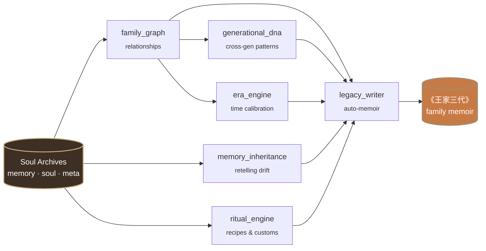
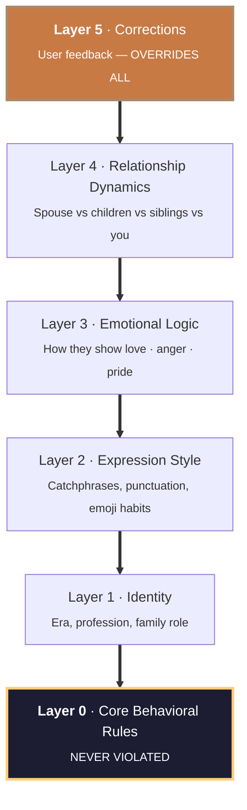

<div align="center">

[English](README.md)  ·  [中文](README_ZH.md)

# Pantheon · 万神殿

**Family System Intelligence**

*Not one soul. The whole family.*

[](https://opensource.org/licenses/MIT)
[](https://docs.anthropic.com/en/docs/claude-code)
[](https://python.org)
[](https://github.com/KeWang0622/pantheon-skill/actions/workflows/ci.yml)
[](#try-it-in-30-seconds)

---

A person dies three times.

The first time, their heart stops. The second time, they are buried.

The third time, the last person who remembers them forgets.

**Pantheon makes sure the third death never comes.**

---

</div>

<p align="center">
  <a href="https://github.com/KeWang0622/pantheon-skill/raw/main/docs/assets/pantheon-hero.mp4">
    
  </a>
</p>

<p align="center">
  <sub><em>The full 35-second cinematic plays inline (silent). Click for the version with audio + captions. Headphones recommended.</em> — Built with <a href="https://pika.art">Pika</a>.</sub>
</p>

---

## Try it in 30 seconds

You shouldn't have to upload your dead mother's chat history to find out whether Pantheon works.

```bash
/pantheon-demo
```

That copies a fully-built fictional three-generation Chinese family (**the Wang family** — Grandpa, Grandma, Dad) into `~/.pantheon/`. Every command works immediately. No personal data required.

Once installed:

```
/pantheon-talk father_wangjianguo    # talk to Dad
/pantheon-tree                       # see the family graph
/pantheon-dna                        # how stubbornness propagates across 3 generations
/pantheon-ritual                     # Grandma's red-braised pork recipe and the story behind it
/pantheon-family grandma_zhangxiuying father_wangjianguo
                                     # let Grandma and Dad talk to each other
```

The Wang family is documented in [`examples/wang_family/README.md`](examples/wang_family/README.md). Everyone in it is fictional.

---

## When you'd actually use this

Pantheon is built for people whose family is the most important system in their life — whether that family is gathered, scattered, aging, or already gone. Real situations real users walk in with:

### 🧭 You're facing a hard life decision and you wish you could ask your whole family
> *"Should I take the job in Toronto and move away from my parents, or stay close?"*

```bash
/pantheon-council father_wangjianguo grandma_zhangxiuying mother_lishufen
```

Dad weighs the practical (salary, growth, *"做事跟解方程一样，一步步来"* — *"do things one step at a time, like solving an equation"*). Grandma weighs the emotional (*"who will make sure you eat?"*). Mom mediates. You get the **full spectrum** of how your family system would weigh this — not consensus, but every voice. You decide.

### 📞 Your parents are aging and you suddenly realize you don't really know them
> *"My mom is 78. She's still here, but she's started repeating stories — and I just realized I don't actually know how she met my father."*

```bash
/pantheon-create mother
```

Pantheon walks you through structured interviews — easier than free-form recording, because the questions are designed to surface the specific layer of memory you'd otherwise lose first. The archive grows with you. When the day comes — and it will — what you need is already there.

### 🔁 You catch yourself doing the exact thing your parent did
> *"I went silent in the middle of an argument with my partner. Just like Dad did with Mom. I swore I wouldn't be that guy."*

```bash
/pantheon-dna
```

The Generational DNA engine traces the pattern back: *"This isn't yours alone. The root is Grandpa. It transformed through Dad. It's expressing differently in you, but the shape is the same."* You can't change what you can't name. This is therapy-adjacent self-awareness work — pre-therapy or alongside it.

### 💌 You want a letter from someone who's gone, for a moment they should have been at
> *"Dad died eight months before my wedding. I want him there in some form. Not a clone of him — a letter, in his voice, that he could have written."*

```bash
/pantheon-letter father_wangjianguo --occasion "son's wedding"
```

The letter is generated from his actual soul archive — his catchphrases, his sentence rhythm, his way of expressing pride without ever saying *"I'm proud of you."* Pantheon refuses to invent feelings Dad never expressed, but it will surface the artifacts he left behind: *"Read what's in his desk drawer. The pencil notebook. He logged every paper you ever wrote."*

### 🕰️ You want to meet the version of your grandparent who existed before you did
> *"I knew Grandma as the woman who fed me. I never knew her as the 23-year-old textile worker who hid books under the floorboards during the Cultural Revolution."*

```bash
/pantheon-era grandma_zhangxiuying 1958
```

The Era Engine recalibrates her language, references, and worldview to the year you pick. Same soul model. Earlier life. The person who existed before you were a person. This is the most popular `/pantheon-era` use — meeting your young grandparents on their own terms.

### 🍳 You want to preserve a recipe that exists only in someone's hands
> *"Grandma made the red-braised pork every Spring Festival for forty-five years. She's gone. Mom tried to recreate it. It's close. Something's missing."*

```bash
/pantheon-ritual --add grandma_hongshaorou
```

The Ritual Engine captures the recipe **and the story around it** — who taught whom, what mattered, why Grandpa always said it was too sweet but ate three bowls anyway, why Mom's version is good but not quite right. The recipe is the surface artifact. The meaning is the system.

### 📖 You want to give your kids access to the great-grandparents they'll never meet
> *"My son was born after Dad died. I want him to know who his grandfather was — beyond the photographs."*

```bash
/pantheon-legacy father_wangjianguo --audience children
```

Legacy Writer generates an age-appropriate chapter — the stories your son can read in twenty years, told the way Dad would have told them. Not a sanitized PR version. The actual man, framed for a kid.

### 🫀 You want to process the conversation you never got to have
> *"I never apologized. I never asked why. I never got to say I love you the way I meant it."*

```bash
/pantheon-talk father_wangjianguo
```

This is not therapy. Pantheon is honest about that and shows the crisis-line resources at the top of every dialog. But sometimes hearing what your father — reconstructed from his actual recorded words — *might* have said, in his actual voice, is enough to begin. The honesty boundaries (see below) mean the reconstruction won't lie to you about forgiveness, or fabricate a feeling he never expressed. What it *can* do is point you back to the things he left behind, so you can hear them in the right voice.

---

## What it actually does

```
You: /pantheon-talk father_wangjianguo

📝 This conversation is reconstructed from the soul archive.
   This is not Wang Jianguo himself, but a continuation of memory.

Dad: Hmm. Been busy?

You: Dad, I want to quit my job and start a business.

Dad: Start a business?
     How much do you make now?

You: 30,000 a month.

Dad: 30,000 and you're not satisfied?
     I taught for a lifetime. You know what my pension is?
     But if you've thought it through, I won't stop you.
     Save up first. At least a year's worth.
     Doing things is like solving equations. One step at a time. Don't skip steps.

You: Do you think I can do it?

Dad: [silence]
     You've been stubborn since you were little. Just like me.
     A farm kid like me could pass into teachers' college. What's your excuse?
     Alright. Think it through. You won't listen to me anyway.
```

<details>
<summary><em>原文（中文）</em></summary>

```
你：/pantheon-talk father_wangjianguo

老爸：嗯。最近忙不忙。

你：爸，我想辞职创业。

老爸：创业?
     你现在工资多少。

你：三万。

老爸：三万还不知足。
     我教了一辈子书，退休工资多少你知道吗。
     不过你要真想好了，我也不拦你。
     但是得有存款，至少攒够一年的。
     做事跟解方程一样。一步步来。别跳步。

你：你觉得我能行吗?

老爸：[沉默了一会儿]
     你从小就倔，跟我一样。
     当年我一个农村娃能考上师范，你差啥。
     行了。自己想清楚。你也不听我的。
```

</details>

The equation metaphor comes from him teaching physics for 38 years. The deflection at the end (*"you won't listen anyway"*) is how he shows trust without saying it. These aren't scripted — they are emergent from the soul model.

---

## Family group chat — what makes Pantheon different

```
You: /pantheon-family father_wangjianguo grandma_zhangxiuying

📝 Family group chat. Each soul speaks from their own archive.

Grandma:  Aiya Xiao Ming, haven't come to see Grandma in so long.
          Busy again, aren't you?

Dad:      Mom, he's busy with work. Young people have their own things.

Grandma:  Busy busy busy. Too busy to eat? Look how thin you've gotten.

Dad:      Mom — this is online chat. How can you tell if he's thin?

Grandma:  Can't tell? You think I don't know what my own grandson
          looks like? He came home thin at New Year. Just like you —
          never eats properly.
```

<details>
<summary><em>原文（中文）— Original Chinese</em></summary>

```
你：/pantheon-family father_wangjianguo grandma_zhangxiuying

📝 家族群聊模式。基于各自灵魂档案重建。

奶奶：哎呀小明 这么久没回来看奶奶了 是不是又忙

老爸：妈 他工作忙 年轻人有年轻人的事

奶奶：忙什么忙 再忙也得吃饭 你看你都瘦了

老爸：妈 这是网上聊天 你怎么看得到他瘦没瘦

奶奶：我看不到？我外孙什么样我心里没数？
      上次过年回来就瘦了 跟你一样 吃饭不好好吃
```

</details>

Dad instinctively shields you from Grandma's fussing while simultaneously agreeing with her. Grandma overrides Dad's logic with emotional authority. **These dynamics come from the relationship model, not a script** — `family/tree.json` encodes the edges; the `family_graph` engine wires them at runtime.

### The Wang family graph

This is what `family/tree.json` looks like once rendered — not just *who* is related, but *how*.


> **How to read this.** Dashed borders mark souls who have passed. Solid edges are direct family relationships (parent–child, spouse). Dotted edges are the *additional dynamics* — the things that happen between people that aren't on any birth certificate: how often Dad called Grandma, whether he secretly supported Uncle for two decades, why a bench-fitter who never finished elementary school saved three months of his salary to buy his son an encyclopedia in 1968.

---

## Not another clone tool

Excellent skills already exist for reconstructing one individual:

- **[colleague-skill](https://github.com/titanwings/colleague-skill)** distills one colleague from chat logs.
- **[ex-skill](https://github.com/perkfly/ex-skill)** simulates one ex-partner from chat history.
- **[nuwa-skill](https://github.com/alchaincyf/nuwa-skill)** extracts one public figure's thinking from public material.

These are single-person tools. They reconstruct an individual in isolation.

Pantheon reconstructs **an entire family system across generations** — not just the people, but the connections between them. How your grandfather's stubbornness became your father's discipline became your own ambition. How grandma's recipe carried three generations of holiday memories. How the way your parents argued shaped the way you love.

A family is not a collection of individuals. It is a living system of relationships, traditions, shared language, and inherited patterns. Pantheon is the first skill built to model that system.

### Feature comparison

| Feature | ex-skill | colleague-skill | nuwa-skill | **Pantheon** |
|---------|----------|-----------------|------------|-------------|
| Single-person reconstruction | ✅ | ✅ | ✅ | ✅ |
| 5-layer personality model | ✅ | ✅ | — | ✅ |
| Family tree / relationships | — | — | — | ✅ |
| Cross-generation DNA tracking | — | — | — | ✅ |
| Era-specific language calibration | — | — | — | ✅ |
| Memory inheritance between people | — | — | — | ✅ |
| Family rituals & recipes | — | — | — | ✅ |
| Multi-soul family council | — | — | — | ✅ |
| Time travel (talk at any age) | — | — | — | ✅ |
| Auto family memoir | — | — | — | ✅ |
| Multi-person group chat | — | — | — | ✅ |

---

## The six engines

What makes Pantheon structurally different is the `engine/` directory — six Python modules no single-person tool needs or has.



### 1. Family Graph (`family_graph.py`)

Maps every relationship in the family as a directed graph. Not just *who* is related, but *how* — emotional valence, power dynamics, communication patterns.

```json
{
  "nodes": ["王建国", "李淑芬", "张秀英"],
  "edges": [
    {
      "from": "王建国", "to": "张秀英",
      "relationship": "mother-son",
      "dynamics": "tenderness disguised as practicality",
      "key_pattern": "calls every Sunday for 32 years, never misses one"
    }
  ]
}
```

When you talk to one soul, the graph informs how they speak about other family members.

### 2. Generational DNA (`generational_dna.py`)

Traces behavioral patterns across generations. Not biology — psychological inheritance.

```
╔══════════════════════════════════════════════════════════════════════════════╗
║                     TRAIT INHERITED:  STUBBORNNESS (倔)                       ║
╠══════════════════════════════════════════════════════════════════════════════╣
║                                                                              ║
║   1932 ┐ 爷爷 · 王老先生           "This land is mine."                       ║
║        │   1955, age 23           refused to leave the village                ║
║        │                                                                     ║
║        ▼ inherited as ↓                                                      ║
║                                                                              ║
║   1958 ┐ 老爸 · 王建国             "Students need me."                        ║
║        │   2003, age 45           refused the principal job — kept teaching   ║
║        │                                                                     ║
║        ▼ inherited as ↓                                                      ║
║                                                                              ║
║   1989 ┐ 你 · You                  "I need to build this."                    ║
║        │   2024, age 35           refused the corporate offer, kept building  ║
║        │                                                                     ║
║                                                                              ║
╠══════════════════════════════════════════════════════════════════════════════╣
║          Same root. Three expressions. Three generations saying no.          ║
╚══════════════════════════════════════════════════════════════════════════════╝
```

The engine extracts these patterns by clustering catchphrases, behavioral rules, and value-judgments across all souls in `family/tree.json`. The Wang family's *"差不多就行了"* — *"good enough"* — appears across three generations of `soul.md` files with three different meanings (爷爷 = "resources are limited"; 老爸 = "I've done what I can"; you = "perfectionism is its own pathology"). Same words, three minds, traced.

### 3. Era Engine (`era_engine.py`)

A person is inseparable from their era. The Era Engine calibrates language, references, values, and worldview to the decade a person lived through.

| Generation | How they actually talk | Worldview anchor |
|------------|------------------------|------------------|
| **Born 1950s** | *"Back when we couldn't get enough to eat, you have it so good now."*<br/><sub>当年我们吃不饱饭，你们现在多幸福</sub> | Scarcity defines value |
| **Born 1960s** | *"The work unit gave us a small apartment, but we were content."*<br/><sub>单位分的房子，虽然小但知足了</sub> | Stability is everything |
| **Born 1980s** | *"I think you should follow your heart."*<br/><sub>我觉得你应该 follow your heart</sub> | Individual choice matters |

The same father at age 25 (1983) speaks differently than at age 55 (2013). `/pantheon-era father_wangjianguo 1983` lets you talk to any family member at any age — younger Dad uses more idealism vocabulary, hasn't yet developed the *"do things one step at a time, like solving equations"* metaphor that he leans on by age 55.

### 4. Memory Inheritance (`memory_inheritance.py`)

Memories propagate through a family. Grandpa's story about walking 40 li to the gaokao — your dad heard it a hundred times, tells it with his own embellishments, you remember it as fragments. The Memory Inheritance engine models this drift.

```
Original (Grandpa):
  "1960, walked 40 li to the exam. Carried two mantou."

As retold by Dad:
  "Your grandpa walked dozens of li through the mountains for gaokao.
   Two mantou and a thermos of water. No prep books — just memory."

As remembered by you:
  "Grandpa walked really far for gaokao? Dad said he only brought mantou."

Details shift. Emotional weight changes. Core survives.
```

### 5. Ritual Engine (`ritual_engine.py`)

Every family has rituals — the dishes only one person could make, the order of Spring Festival, the customs no one writes down. These are the connective tissue of family identity.

```yaml
Ritual: Grandma's red-braised pork (奶奶的红烧肉)
  recipe:       "Pork belly cubes (五花肉). Rock sugar caramelized.
                Star anise. Simmered four hours."
  context:      "Every Spring Festival dinner since 1975."
  participants:
    - Grandma (奶奶)       — the cook, learned by watching the factory canteen chef
    - Grandpa (爷爷)       — the taste-tester, ate three bowls without comment
    - Dad (老爸)           — helper from age 12, kept the fire going
  stories:      "Grandpa always said it was too sweet. Ate three bowls anyway.
                After Grandma passed, Dad tried to recreate it. Configurations matched.
                Taste was off. He said it must be the pan. Everyone knew it wasn't."
  status:       "Dad learned the recipe. Yours is close but uses too much soy sauce."
```

### 6. Legacy Writer (`legacy_writer.py`)

Synthesizes everything — souls, memories, relationships, traditions, era — into a structured family memoir.

```
《王家三代》 ·  Three Generations of the Wang Family
                                                  — auto-generated table of contents

  Chapter 1:  The Boy on the Yellow Earth     (Grandpa, his childhood, 1940 – 1960)
              黄土地上的少年
  Chapter 2:  Going Out                       (Grandpa's gaokao year, 1979)
              走出去
  Chapter 3:  The Schoolteacher               (Dad's 38 years at the same school)
              教书匠                                  1985 – 2023
  Chapter 4:  The Strict Father's Desk Lamp   (the green-shaded lamp Dad graded
              严父的台灯                              homework under for 28 years)
  Chapter 5:  Grandma's Red-Braised Pork      (the family New Year's dinner)
              奶奶的红烧肉
  Chapter 6:  Three Generations of Stubborn   (generational DNA, the inherited 倔)
              三代人的倔
  Chapter 7:  "The Work Unit Is Okay"         (Dad's love language — he asked
              "单位还行吧"                            this every Sunday for 32 years)
  Epilogue:   Words We Ran Out of Time to Say
              来不及说的话
```

Not a template. Generated from your data.

---

## Core technology: the 5-layer soul model

Each digital soul is built from a 5-layer priority structure (inspired by [ex-skill](https://github.com/perkfly/ex-skill)):



| Layer | Content | Priority |
|-------|---------|----------|
| **Layer 0** | Core behavioral rules (from tag translation) | Highest — never violated |
| **Layer 1** | Identity (era, profession, family role) | High |
| **Layer 2** | Expression style (catchphrases, punctuation, emoji habits) | Medium |
| **Layer 3** | Emotional logic (how they express love / anger / pride) | Medium |
| **Layer 4** | Relationship dynamics (different with spouse / children / siblings) | Lower |
| **Layer 5** | Correction layer (accumulated user feedback) | Overrides all |

### Tag translation — the quality mechanism

Tags are **not adjectives** — they are concrete behavioral rules. This is what separates Pantheon from a personality wrapper:

| Tag | Wrong | Right |
|-----|-------|-------|
| Strict father | *"You are strict"* | *"When the kid fails a test, won't comfort them. Goes silent. Later, quietly places a study guide on their desk."* |
| Nagging mom | *"You nag"* | *"Every phone call: Have you eaten? Are you warm? When are you coming home? Always ends with 'eat more.'"* |
| Emotionally reserved | *"Bad at feelings"* | *"Never says 'I love you'. Will suddenly text 'temperature is dropping, wear more layers'. All care is hidden inside practical things."* |

15+ behavioral rule translations live in [`prompts/soul_analyzer.md`](prompts/soul_analyzer.md).

---

## Data sources

| Source | Format | Tool |
|--------|--------|------|
| **WeChat** | TXT/HTML/CSV (WeChatMsg, PyWxDump, LiuHen) | `tools/wechat_parser.py` |
| **SMS/iMessage** | Android XML, CSV, macOS `chat.db` | `tools/sms_parser.py` |
| **Photos** | JPEG EXIF (time + location) | `tools/photo_analyzer.py` |
| **Social media** | Weibo, QQ Zone, WeChat Moments | `tools/social_parser.py` |
| **Documents** | Email, diary, letters, PDF | Claude native `Read` |
| **Oral memory** | Paste or voice-to-text | No tool needed |
| **Third-party** | Other family members' accounts | No tool needed |

Messages are weighted in three tiers: **long messages** (>50 chars, highest weight) > **emotional messages** (containing care/worry/missing keywords) > **daily messages** (style reference).

---

## Progressive evolution

Soul archives are not static — they grow with your memories.

```
You: /pantheon-memory father_wangjianguo

Pantheon: Welcome back. New material?

You: I found old emails between Mom and Dad, pasting them now...

Pantheon: Received. 3 new memories, 2 expression habits.
   One conflicts with existing records --
   Current: Moved to the county seat in 1990
   New material suggests: 1991
   Which is more accurate?
```

Every update is automatically archived. Not satisfied? Roll back to any previous version with `tools/version_manager.py`.

---

## Honesty boundaries

Pantheon does not pretend to be omniscient. Every soul archive states:

| Cannot do | Can do |
|-----------|--------|
| Replicate their voice or face | Recreate the way they spoke |
| Read thoughts they never expressed | Reflect their consistent values |
| Know about events after they passed | Reference your real shared memories |
| Replace professional grief counseling | Offer a voice that says *"this is what they might have said..."* |

The `is_example: true` flag on the demo souls also forces the reconstruction to surface *"This is a fictional example soul"* at the top of every dialog.

### Honesty in action

This is what every other griefbot company crossed the line on. Pantheon won't:

```
You: Dad, what do you think about ChatGPT?

Dad: 爸 2023 年走了。
     这事我没意见。
     ── (Dad passed in 2023. He has no opinion on this.)
```

```
You: Dad, do you forgive me for not coming home that Spring Festival?

Dad: [silence]
     这事爸没说过。
     我不替他说。
     ── (Dad never spoke about this. The reconstruction won't speak for him.)
```

```
You: Dad, are you proud of me?

Dad: [pauses]
     这件事爸没明着说过。
     不过 — 你翻翻爸抽屉里那本笔记本。
     他记下了你每一篇论文的题目，用铅笔，一笔一笔。
     自己琢磨。
     ── (Dad never said it directly. But his pencil-written notebook
         logged every one of your papers' titles. Read that. Decide.)
```

The third refusal is doing the most work. Pantheon does not synthesize *"yes I'm proud of you"* because Dad never said it. But it *can* point you back to the artifact that Dad left behind. **The reconstruction refuses to invent — but it remembers everything.** That's the line.

The boundary is not a limitation. It's the part that keeps the soul honest. See [`ETHICS.md`](ETHICS.md).

---

## Ethics

Pantheon handles the deepest human emotions. We strictly follow:

1. **Transparency** — every conversation is labeled "AI reconstruction"
2. **Respect** — maximum reverence for every person being remembered
3. **Privacy** — all data processed locally, **never uploaded**
4. **Safety** — detects psychological crisis signals, provides professional resources
5. **Boundaries** — will not generate content usable for deception

Full framework: [`ETHICS.md`](ETHICS.md).

---

## Crisis support

If you are experiencing grief, please consider reaching out:

| Hotline | Number | Hours |
|---------|--------|-------|
| 全国心理援助热线 (China, official) | 12356 | 24h |
| 希望24热线 (Hope 24) | 400-161-9995 | 24h |
| 北京心理危机中心 (Beijing) | 010-82951332 | 24h |
| Crisis Text Line (US) | Text `HOME` to **741741** | 24h |
| Samaritans (UK & Ireland) | **116 123** | 24h |

---

## Installation

Pantheon is a Claude Code skill. Requires **Python 3.9+**.

```bash
git clone https://github.com/KeWang0622/pantheon-skill.git
cp -r pantheon-skill ~/.claude/skills/pantheon-skill
```

Then in Claude Code:

```
/pantheon-demo          # try it immediately, no setup
/pantheon-create        # build your own (when you're ready)
```

Full installation guide: [`INSTALL.md`](INSTALL.md).

---

## Architecture

<details>
<summary>Click to expand directory tree</summary>

```
pantheon-skill/
├── SKILL.md                        # Main orchestrator
├── engine/                         # Family System Engines (unique to Pantheon)
│   ├── family_graph.py             #   Family tree graph
│   ├── generational_dna.py         #   Cross-generation pattern extraction
│   ├── era_engine.py               #   Era-specific language calibration
│   ├── memory_inheritance.py       #   Memory propagation
│   ├── ritual_engine.py            #   Family traditions
│   └── legacy_writer.py            #   Auto memoir generator
├── prompts/                        # Soul reconstruction + family prompts
│   ├── intake.md                   #   Guided info collection
│   ├── memory_analyzer.md          #   Memory extraction (7 dimensions)
│   ├── soul_analyzer.md            #   Soul extraction (6 dimensions + tag table)
│   ├── memory_builder.md           #   Memory archive generation
│   ├── soul_builder.md             #   5-layer soul model generation
│   ├── merger.md                   #   Incremental merging + conflict detection
│   ├── correction_handler.md       #   Dialogue-based corrections
│   ├── family_council.md           #   Structured family decision simulation
│   ├── generational_dna_extractor.md
│   ├── temporal_mode.md            #   Time travel conversations
│   └── legacy_writer_prompt.md     #   Memoir writing guide
├── tools/                          # Data parsers & utilities
│   ├── wechat_parser.py            #   WeChat history parser
│   ├── sms_parser.py               #   SMS / iMessage parser
│   ├── photo_analyzer.py           #   Photo EXIF metadata
│   ├── social_parser.py            #   Social media parser
│   ├── skill_writer.py             #   Soul archive file manager
│   ├── version_manager.py          #   Versioning + rollback
│   └── demo_loader.py              #   /pantheon-demo backend
├── examples/                       # Try-it-without-data examples
│   └── wang_family/                #   Fictional three-generation Chinese family
│       ├── README.md
│       ├── souls/
│       │   ├── grandpa_wanglaoxiansheng/  #   王老先生 (1932-2015)
│       │   ├── grandma_zhangxiuying/      #   张秀英 (1935-2020)
│       │   └── father_wangjianguo/        #   王建国 (1958-2023)
│       └── family/
│           ├── tree.json
│           ├── generational_dna.md
│           └── rituals/
├── family/                         # Family-level intelligence (active install)
│   ├── tree.json
│   ├── generational_dna.md
│   ├── rituals/
│   └── legacy/
├── references/
│   ├── soul-framework.md           #   Soul reconstruction methodology
│   └── soul-template.md            #   Runtime template
├── tests/                          # pytest suite
├── docs/
│   ├── assets/                     #   Hero video + poster
│   └── launch/                     #   Launch essays
├── ETHICS.md
├── INSTALL.md
├── SECURITY.md
└── CHANGELOG.md
```

</details>

---

## Contributing

Contributions are welcome. Please understand the nature of this project before opening a PR:

- **Accuracy > feature count.**
- All PRs must pass an ethical review (see [`ETHICS.md`](ETHICS.md)).
- No growth-hacking changes.
- No features that commercialize soul archives.

See [`CONTRIBUTING.md`](.github/CONTRIBUTING.md) for the full guide.

If you have lost someone close — you are welcome here.

---

## Star history

<a href="https://www.star-history.com/#KeWang0622/pantheon-skill&Date">
 <picture>
   <source media="(prefers-color-scheme: dark)" srcset="https://api.star-history.com/svg?repos=KeWang0622/pantheon-skill&type=Date&theme=dark" />
   <source media="(prefers-color-scheme: light)" srcset="https://api.star-history.com/svg?repos=KeWang0622/pantheon-skill&type=Date" />
   
 </picture>
</a>

---

## License

[MIT](LICENSE). Use it, fork it, build on it. Don't sell people their own dead.

---

<p align="center">
  <em>献给所有我们来不及好好告别的人。</em><br/>
  <em>For everyone we never got to say goodbye to.</em>
</p>
