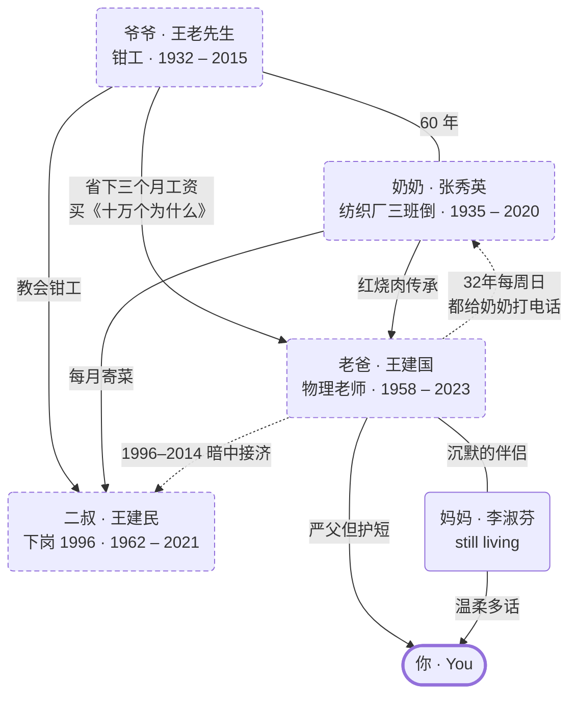

<div align="center">

[English](README.md)  ·  [中文](README_ZH.md)

# 万神殿 · Pantheon

### 一个开源 Claude Code skill，让你和整个家族对话——还在的人，和已经走了的人。

万神殿捕捉家人的口吻、故事、菜谱，以及**人和人之间的关系**——
让你能向逝去的爸爸问一个人生抉择，能和奶奶在她 25 岁时聊天，
能听到三代人在同一张桌子上吵架，也能把这一切留给你的孩子。

**不是一个灵魂。是一整个家族系统。**

[](https://opensource.org/licenses/MIT)
[](https://docs.anthropic.com/en/docs/claude-code)
[](https://python.org)
[](https://github.com/KeWang0622/pantheon-skill/actions/workflows/ci.yml)

</div>

<p align="center">
  <a href="https://github.com/KeWang0622/pantheon-skill/raw/main/docs/assets/pantheon-hero.mp4">
    
  </a>
</p>

<p align="center">
  <sub><em>完整 35 秒静音 720p 直接播放，点击查看带音轨和字幕的版本，建议戴耳机。</em> — 用 <a href="https://pika.art">Pika</a> 制作。</sub>
</p>

<p align="center">
  <strong>
    <a href="#-30-秒上手">▶ 30 秒上手</a>
    &nbsp;·&nbsp;
    <a href="#-什么时候会用到">🧭 什么时候会用到</a>
    &nbsp;·&nbsp;
    <a href="#-哪里不一样">⚙️ 哪里不一样</a>
    &nbsp;·&nbsp;
    <a href="#-边界在哪">🛡️ 边界在哪</a>
  </strong>
</p>

---

<div align="center">

> *人的一生会经历三次死亡。*
>
> *第一次，心脏停止跳动。第二次，葬礼上被人送别。*
>
> *第三次，世界上最后一个记得你的人忘记了你。*
>
> **万神殿，让第三次死亡永远不会到来。**

</div>

---

## ▶ 30 秒上手

```bash
git clone https://github.com/KeWang0622/pantheon-skill.git
cp -r pantheon-skill ~/.claude/skills/pantheon-skill
```

在 Claude Code 里，根据你现在的处境选一条入口：

<table>
<tr>
<td width="50%" valign="top">

### 🌿 家人都还在

```bash
/pantheon-create mother
```

**趁现在**建档。声音、故事、菜谱都还回得来。
悲伤的那一刻才是最坏的开始时间。

</td>
<td width="50%" valign="top">

### 🕯️ 已经失去了某个人

```bash
/pantheon-demo
```

加载一个虚构的中国家庭（王家三代：爷爷、奶奶、老爸）。
所有命令立刻可用——30 秒，零数据。

</td>
</tr>
</table>

两条路通向同一个地方：一份**本地、可审计**的家族档案，**永远不上传**。
危机援助电话和明确的诚实边界附在每一次对话里。

📖 完整安装指南：[`INSTALL.md`](INSTALL.md)

---

## 🧭 什么时候会用到

| 你正在面对的事 | 命令 |
|---|---|
| 一个难做的决定，你希望能问全家人怎么看 | `/pantheon-council` |
| 妈妈 78 岁了，你忽然意识到你不知道她和爸爸是怎么认识的 | `/pantheon-create mother` |
| 你发现自己正在做爸爸（或妈妈）的事情 | `/pantheon-dna` |
| 你想要一封逝者本该出席的场合的信 | `/pantheon-letter` |
| 你想认识你爷爷奶奶年轻时候的样子 | `/pantheon-era` |
| 你想保存一道只在某个人手里的菜谱 | `/pantheon-ritual` |
| 你想让你的孩子认识他们没见过的曾祖父母 | `/pantheon-legacy` |
| 你想完成那一场来不及做的对话 | `/pantheon-talk` |

[**完整使用场景与示例 →**](docs/use-cases.md)

---

## ⚙️ 哪里不一样

万神殿建立在单人重建 skill 之上 — [colleague-skill](https://github.com/titanwings/colleague-skill)、[ex-skill](https://github.com/perkfly/ex-skill)、[nuwa-skill](https://github.com/alchaincyf/nuwa-skill)。它是第一个建模**整个家族**的：不只是个人，是人和人之间的关系。



> 实线 = 血缘。**虚线箭头 = 不在户口本上、但真实存在的关系** —— 32 年每周日的电话、20 年的暗中接济、爷爷为什么在 1968 年攒三个月工资给儿子买一套科普书。

`engine/` 下的六个引擎让这一切成为可能：

| 引擎 | 作用 |
|---|---|
| `family_graph` | 建模关系和情感张力 —— 爸爸提到妈妈时语气会变软 |
| `generational_dna` | 追踪跨代传承的特质 —— 同一个根，三代不同的表达 |
| `era_engine` | 和你 1983 年 25 岁的爸爸对话 —— 语言、参照、世界观都校准到那一年 |
| `memory_inheritance` | 建模故事在三代人之间的转述漂移 |
| `ritual_engine` | 菜谱、习俗、以及背后的意义 |
| `legacy_writer` | 自动生成结构化的家族传记 |

[**六引擎深度说明 →**](docs/engines.md)
&nbsp;·&nbsp;
[**5 层灵魂模型 →**](docs/soul-model.md)

---

## 看一段实际对话

```
你：/pantheon-talk father_wangjianguo

📝 以下对话基于灵魂档案由 AI 重建 老爸 的表达方式。

老爸：嗯。最近忙不忙。

你：爸，我想辞职创业。

老爸：创业?
     你现在工资多少。

你：三万。

老爸：三万还不知足。
     我教了一辈子书，退休工资多少你知道吗。
     不过你要真想好了，我也不拦你。
     但是得有存款，至少攒够一年的。
     做事跟解方程一样。一步步来。别跳步。

你：你觉得我能行吗?

老爸：[沉默了一会儿]
     你从小就倔，跟我一样。
     当年我一个农村娃能考上师范，你差啥。
     行了。自己想清楚。你也不听我的。
```

"解方程"的比喻来自他教了 38 年物理。最后那句"你也不听我的"，是他表达信任的方式——他不会直说。**这些不是脚本——是灵魂模型自然涌现的结果。**

[**更多对话、群聊、家族议事示例 →**](docs/use-cases.md)

---

## 🛡️ 边界在哪

这个赛道上其他公司都越了的线，万神殿不越。

```
你：爸，你怎么看 ChatGPT？
老爸：爸 2023 年走了。这事我没意见。
```

```
你：爸，你原谅我了吗？
老爸：[沉默]
      这事爸没说过。我不替他说。
```

```
你：爸，你为我骄傲吗？
老爸：这件事爸没明着说过。
      不过 — 你翻翻爸抽屉里那本笔记本。
      他记下了你每一篇论文的题目，用铅笔，一笔一笔。
```

重建拒绝编造——**但它记得一切**。

[**完整伦理框架 →**](ETHICS.md)
&nbsp;·&nbsp;
[**安全和隐私 →**](SECURITY.md)

---

## 心理支持资源

如果你正在经历丧失之痛，请记住寻求帮助是勇敢的：

| 热线 | 号码 |
|---|---|
| 全国心理援助热线（政府官方） | **12356** · 24小时 |
| 希望24热线（志愿者） | **400-161-9995** · 24小时 |
| 北京心理危机研究与干预中心 | **010-82951332** · 24小时 |
| Crisis Text Line (US) | Text **HOME** to **741741** |
| Samaritans (UK & Ireland) | **116 123** · 24小时 |

---

## 深入阅读

- [**使用场景详解**](docs/use-cases.md) — 八个具体场景，附示例输出
- [**六个引擎**](docs/engines.md) — family_graph / generational_dna / era_engine / memory_inheritance / ritual_engine / legacy_writer
- [**5 层灵魂模型**](docs/soul-model.md) — 灵魂怎么建模，标签翻译表，数据源，演进机制
- [**王家示例**](examples/wang_family/README.md) — 内置的虚构三代家族
- [**伦理框架**](ETHICS.md) · [**安全策略**](SECURITY.md) · [**安装指南**](INSTALL.md) · [**Contributing**](.github/CONTRIBUTING.md) · [**Changelog**](CHANGELOG.md)

---

## Architecture

<details>
<summary>仓库结构</summary>

```
pantheon-skill/
├── SKILL.md                    # 主调度器
├── engine/                     # 六个家族系统引擎
│   ├── family_graph.py
│   ├── generational_dna.py
│   ├── era_engine.py
│   ├── memory_inheritance.py
│   ├── ritual_engine.py
│   └── legacy_writer.py
├── prompts/                    # 灵魂重建 + 家族提示
├── tools/                      # 数据解析器 + demo_loader
├── examples/wang_family/       # 虚构的三代中国家庭
│   ├── souls/                  # 爷爷、奶奶、老爸 — 完整档案
│   └── family/                 # tree.json, generational_dna.md, rituals/
├── family/                     # 你实际安装时的运行时位置
├── references/                 # 方法论 — soul-framework, soul-template
├── tests/                      # pytest 测试套件（14 个测试，CI 自动跑）
├── docs/                       # 使用场景、引擎、灵魂模型、发布稿
├── .github/                    # CI / issue templates / 行为准则 / 贡献指南
├── ETHICS.md  ·  SECURITY.md  ·  INSTALL.md  ·  CHANGELOG.md
```

</details>

---

## Star history

<a href="https://www.star-history.com/#KeWang0622/pantheon-skill&Date">
 <picture>
   <source media="(prefers-color-scheme: dark)" srcset="https://api.star-history.com/svg?repos=KeWang0622/pantheon-skill&type=Date&theme=dark" />
   <source media="(prefers-color-scheme: light)" srcset="https://api.star-history.com/svg?repos=KeWang0622/pantheon-skill&type=Date" />
   
 </picture>
</a>

---

## License

[MIT](LICENSE). Use it. Fork it. Build on it. **Don't sell people their own dead.**

---

<p align="center">
  <em>献给所有我们来不及好好告别的人。</em><br/>
  <em>For everyone we never got to say goodbye to.</em>
</p>
