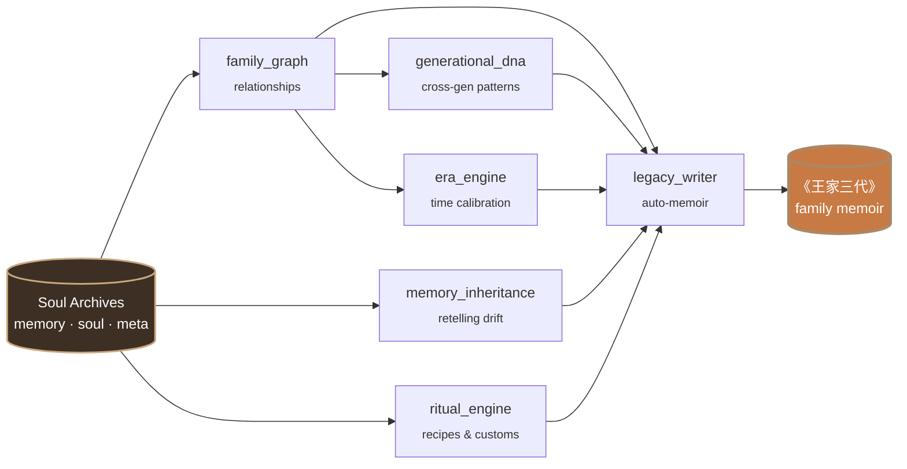

# The six engines

What makes Pantheon structurally different is the `engine/` directory — six Python modules no single-person clone tool needs or has. Each one is a refusal to flatten a family into a list of individuals.



---

## 1. Family Graph (`family_graph.py`)

Maps every relationship in the family as a directed graph. Not just *who* is related, but *how* — emotional valence, power dynamics, communication patterns.

```json
{
  "nodes": ["王建国", "李淑芬", "张秀英"],
  "edges": [
    {
      "from": "王建国", "to": "张秀英",
      "relationship": "mother-son",
      "dynamics": "tenderness disguised as practicality",
      "key_pattern": "calls every Sunday for 32 years, never misses one"
    }
  ]
}
```

When you talk to one soul, the graph informs how they speak about other family members. Dad's tone shifts when he mentions Mom. Grandma softens when she talks about Grandpa.

The Wang family graph is visualized in the [main README](../README.md#how-its-different).

---

## 2. Generational DNA (`generational_dna.py`)

Traces behavioral patterns across generations. Not biology — psychological inheritance.

```
╔══════════════════════════════════════════════════════════════════════════════╗
║                     TRAIT INHERITED:  STUBBORNNESS (倔)                       ║
╠══════════════════════════════════════════════════════════════════════════════╣
║                                                                              ║
║   1932 ┐ 爷爷 · 王老先生           "This land is mine."                       ║
║        │   1955, age 23           refused to leave the village                ║
║        │                                                                     ║
║        ▼ inherited as ↓                                                      ║
║                                                                              ║
║   1958 ┐ 老爸 · 王建国             "Students need me."                        ║
║        │   2003, age 45           refused the principal job — kept teaching   ║
║        │                                                                     ║
║        ▼ inherited as ↓                                                      ║
║                                                                              ║
║   1989 ┐ 你 · You                  "I need to build this."                    ║
║        │   2024, age 35           refused the corporate offer, kept building  ║
║        │                                                                     ║
║                                                                              ║
╠══════════════════════════════════════════════════════════════════════════════╣
║          Same root. Three expressions. Three generations saying no.          ║
╚══════════════════════════════════════════════════════════════════════════════╝
```

The engine extracts these patterns by clustering catchphrases, behavioral rules, and value-judgments across all souls in `family/tree.json`. The Wang family's *"差不多就行了"* — *"good enough"* — appears across three generations of `soul.md` files with three different meanings (爷爷 = "resources are limited"; 老爸 = "I've done what I can"; you = "perfectionism is its own pathology"). Same words, three minds, traced.

---

## 3. Era Engine (`era_engine.py`)

A person is inseparable from their era. The Era Engine calibrates language, references, values, and worldview to the decade a person lived through.

| Generation | How they actually talk | Worldview anchor |
|------------|------------------------|------------------|
| **Born 1950s** | *"Back when we couldn't get enough to eat, you have it so good now."*<br/><sub>当年我们吃不饱饭，你们现在多幸福</sub> | Scarcity defines value |
| **Born 1960s** | *"The work unit gave us a small apartment, but we were content."*<br/><sub>单位分的房子，虽然小但知足了</sub> | Stability is everything |
| **Born 1980s** | *"I think you should follow your heart."*<br/><sub>我觉得你应该 follow your heart</sub> | Individual choice matters |

The same father at age 25 (1983) speaks differently than at age 55 (2013). `/pantheon-era father_wangjianguo 1983` lets you talk to any family member at any age — younger Dad uses more idealism vocabulary, hasn't yet developed the *"do things one step at a time, like solving equations"* metaphor that he leans on by age 55.

---

## 4. Memory Inheritance (`memory_inheritance.py`)

Memories propagate through a family. Grandpa's story about walking 40 li to the gaokao — your dad heard it a hundred times, tells it with his own embellishments, you remember it as fragments. The Memory Inheritance engine models this drift.

```
Original (Grandpa):
  "1960, walked 40 li to the exam. Carried two mantou."

As retold by Dad:
  "Your grandpa walked dozens of li through the mountains for gaokao.
   Two mantou and a thermos of water. No prep books — just memory."

As remembered by you:
  "Grandpa walked really far for gaokao? Dad said he only brought mantou."

Details shift. Emotional weight changes. Core survives.
```

---

## 5. Ritual Engine (`ritual_engine.py`)

Every family has rituals — the dishes only one person could make, the order of Spring Festival, the customs no one writes down. These are the connective tissue of family identity.

```yaml
Ritual: Grandma's red-braised pork (奶奶的红烧肉)
  recipe:       "Pork belly cubes (五花肉). Rock sugar caramelized.
                Star anise. Simmered four hours."
  context:      "Every Spring Festival dinner since 1975."
  participants:
    - Grandma (奶奶)       — the cook, learned by watching the factory canteen chef
    - Grandpa (爷爷)       — the taste-tester, ate three bowls without comment
    - Dad (老爸)           — helper from age 12, kept the fire going
  stories:      "Grandpa always said it was too sweet. Ate three bowls anyway.
                After Grandma passed, Dad tried to recreate it. Configurations matched.
                Taste was off. He said it must be the pan. Everyone knew it wasn't."
  status:       "Dad learned the recipe. Yours is close but uses too much soy sauce."
```

---

## 6. Legacy Writer (`legacy_writer.py`)

Synthesizes everything — souls, memories, relationships, traditions, era — into a structured family memoir.

```
《王家三代》 ·  Three Generations of the Wang Family
                                                  — auto-generated table of contents

  Chapter 1:  The Boy on the Yellow Earth     (Grandpa, his childhood, 1940 – 1960)
              黄土地上的少年
  Chapter 2:  Going Out                       (Grandpa's gaokao year, 1979)
              走出去
  Chapter 3:  The Schoolteacher               (Dad's 38 years at the same school)
              教书匠                                  1985 – 2023
  Chapter 4:  The Strict Father's Desk Lamp   (the green-shaded lamp Dad graded
              严父的台灯                              homework under for 28 years)
  Chapter 5:  Grandma's Red-Braised Pork      (the family New Year's dinner)
              奶奶的红烧肉
  Chapter 6:  Three Generations of Stubborn   (generational DNA, the inherited 倔)
              三代人的倔
  Chapter 7:  "The Work Unit Is Okay"         (Dad's love language — he asked
              "单位还行吧"                            this every Sunday for 32 years)
  Epilogue:   Words We Ran Out of Time to Say
              来不及说的话
```

Not a template. Generated from your data.
