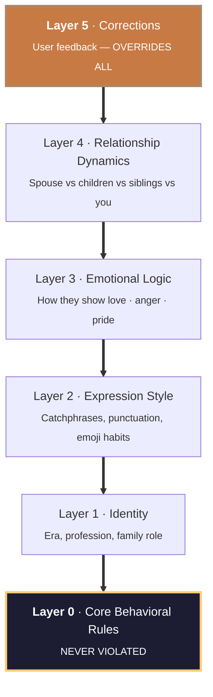

# The 5-layer soul model

Each digital soul is built from a 5-layer priority structure (inspired by [ex-skill](https://github.com/perkfly/ex-skill)).



| Layer | Content | Priority |
|-------|---------|----------|
| **Layer 0** | Core behavioral rules (from tag translation) | Highest — never violated |
| **Layer 1** | Identity (era, profession, family role) | High |
| **Layer 2** | Expression style (catchphrases, punctuation, emoji habits) | Medium |
| **Layer 3** | Emotional logic (how they express love / anger / pride) | Medium |
| **Layer 4** | Relationship dynamics (different with spouse / children / siblings) | Lower |
| **Layer 5** | Correction layer (accumulated user feedback) | Overrides all |

---

## Tag translation — the quality mechanism

Tags are **not adjectives** — they are concrete behavioral rules. This is what separates Pantheon from a personality wrapper:

| Tag | ❌ Wrong | ✅ Right |
|-----|----------|---------|
| Strict father | *"You are strict"* | *"When the kid fails a test, won't comfort them. Goes silent. Later, quietly places a study guide on their desk."* |
| Nagging mom | *"You nag"* | *"Every phone call: Have you eaten? Are you warm? When are you coming home? Always ends with 'eat more.'"* |
| Emotionally reserved | *"Bad at feelings"* | *"Never says 'I love you'. Will suddenly text 'temperature is dropping, wear more layers'. All care is hidden inside practical things."* |

15+ behavioral rule translations live in [`prompts/soul_analyzer.md`](../prompts/soul_analyzer.md).

---

## How the layers interact

When a dialog turn is generated, the layers are consulted in order:

1. **Layer 0** is evaluated as a hard veto. If a response would require violating a core behavioral rule (e.g. "Dad never says 'I love you'"), the response is rejected outright.
2. **Layer 1** provides the era and identity envelope. A 1960s-born middle-school teacher does not use Twitter idioms.
3. **Layer 2** shapes the surface text — catchphrases, sentence rhythm, punctuation, emoji habits.
4. **Layer 3** shapes the emotional register — how care is signaled (cold-weather warnings vs verbal affection), how anger is expressed (silence vs raised voice).
5. **Layer 4** customizes everything above based on who they're talking to — Dad speaks differently to you than to your mother.
6. **Layer 5** — if you've corrected the model on this exact context before, your correction wins, no matter how strongly the lower layers point elsewhere.

The honesty boundary sits outside the stack: even Layer 5 cannot override the refusal to invent feelings the person never expressed.

---

## Data sources that build the soul

| Source | Format | Parser |
|--------|--------|--------|
| **WeChat** | TXT/HTML/CSV (WeChatMsg, PyWxDump, LiuHen) | [`tools/wechat_parser.py`](../tools/wechat_parser.py) |
| **SMS/iMessage** | Android XML, CSV, macOS `chat.db` | [`tools/sms_parser.py`](../tools/sms_parser.py) |
| **Photos** | JPEG EXIF (time + location) | [`tools/photo_analyzer.py`](../tools/photo_analyzer.py) |
| **Social media** | Weibo, QQ Zone, WeChat Moments | [`tools/social_parser.py`](../tools/social_parser.py) |
| **Documents** | Email, diary, letters, PDF | Claude native `Read` |
| **Oral memory** | Paste or voice-to-text | No tool needed |
| **Third-party** | Other family members' accounts | No tool needed |

Messages are weighted in three tiers: **long messages** (>50 chars, highest weight) > **emotional messages** (containing care/worry/missing keywords) > **daily messages** (style reference).

---

## Progressive evolution

Soul archives are not static — they grow with your memories.

```
You: /pantheon-memory father_wangjianguo

Pantheon: Welcome back. New material?

You: I found old emails between Mom and Dad, pasting them now...

Pantheon: Received. 3 new memories, 2 expression habits.
   One conflicts with existing records --
   Current: Moved to the county seat in 1990
   New material suggests: 1991
   Which is more accurate?
```

Every update is automatically archived. Not satisfied? Roll back to any previous version with [`tools/version_manager.py`](../tools/version_manager.py).
